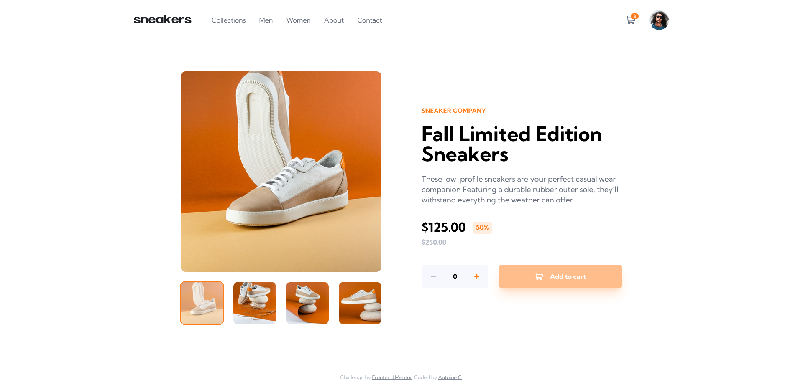

# Frontend Mentor - E-commerce product page solution

This is a solution to the [E-commerce product page challenge on Frontend Mentor](https://www.frontendmentor.io/challenges/ecommerce-product-page-UPsZ9MJp6).

## Table of contents

- [Overview](#overview)
  - [The challenge](#the-challenge)
  - [Screenshot](#screenshot)
  - [Links](#links)
- [My process](#my-process)
  - [Built with](#built-with)
  - [What I learned](#what-i-learned)
  - [Continued development](#continued-development)
  - [Useful resources](#useful-resources)
- [Author](#author)
- [Acknowledgments](#acknowledgments)

## Overview

### The challenge

Users should be able to:

- View the optimal layout for the site depending on their device's screen size
- See hover states for all interactive elements on the page
- Open a lightbox gallery by clicking on the large product image
- Switch the large product image by clicking on the small thumbnail images
- Add items to the cart
- View the cart and remove items from it

### Screenshot

### Links

- Solution URL: [Go to solution](https://www.frontendmentor.io/solutions/rest-countries-api-w-svelkit-ts-tailwind-axios-and-ssr-prefetching-i4wDMW6EGE)
- Live Site URL: [Go to live site](https://rest-countries-api-seven-taupe.vercel.app/)

## My process

### Built with

- Semantic HTML5 markup
- Flexbox
- CSS Grid
- Mobile-first workflow
- [LocalStorage](https://developer.mozilla.org/fr/docs/Web/API/Window/localStorage) - Save data on the browser
- [SvelteKit](https://kit.svelte.dev/) - JS framework w/ SSR (Server-Side Rendering)
- [TailwindCss](https://tailwindcss.com/) - Utility-first CSS framework
- [Typescript](https://www.typescriptlang.org/) - Strongly typed JS

### What I learned

### Continued development

### Useful resources

- [Heroicons](https://heroicons.com/) - Beautiful hand-crafted SVG icons, by the makers of Tailwind CSS.
- [Phosphoricons](https://phosphoricons.com/) - Flexible icon family for interfaces, diagrams, presentations, etc...

## Author

- Frontend Mentor - [@AntoineC-dev](https://www.frontendmentor.io/profile/AntoineC-dev)
